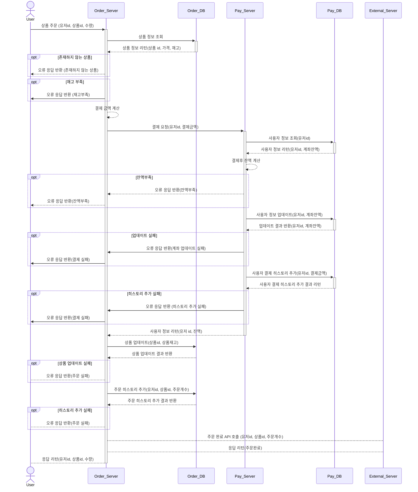

# hh-plus-3-commerce

e-커머스 상품 주문 서비스

## Step7 변경사항

유저 / 계좌 테이블 분리
=> 결제 시에 사용자 정보 업데이트를 하고 있는데, 결제의 경우 잔액 정합성을 위해 일반 사용자 정보 업데이트(이름이나 정보 변경 등)과 다른 결제 API가 별도로 존재하여 비관적 잠금이 개별로 가능하게 하는 것이
바람직함

api url과 response dto 이름 맞춤
=> 그 외에도 유저 잔액 조회에서 요청은 balance인데, 클래스 네이밍은 Account Request/Response 임
=> 유저 잔액 충전의 경우도 비슷하며, 충전은 특정 동작에 대한 API이므로 POST + 컨트롤 URI로 설계하는 것이 바람직해 보입니다. ex)
/api/v1/users/{userId}/balance/deposit

:: account api 따로 분리함

## 기능 목록

- [ ] 잔액 조회 API
- [ ] 잔액 충전 API
    - [ ] 잔액 충전 내역 저장
    - [ ] 유저 ID, 충전 금액 입력 -> ID, 충전 후 금액 리턴
- [ ] 상품 조회 API
    - [ ] 상품 ID로 조회 -> ID, 이름, 가격, 잔여수량 리턴
- [ ] 상품 주문 API
    - [ ] 상품 주문 내역 저장
    - [ ] 유저 ID로 조회 -> ID, 상품 ID, 주문 수량 리턴
- [ ] 결제
    - [ ] 결제 내역 조회
    - [ ] 유저 ID, 결제금액 입력 -> 유저 ID, 잔액 리턴
- [ ] 인기 판매 상품 조회 API
    - [ ] 판매량 순으로 상품 조회

고도화

- [ ] 다중 인스턴스 지원 (동시성 고려)
- [ ] 멀티쓰레드 지원 (동시성 고려)
- [ ] 재고관리 (문제가 없도록?)
- [ ] 단위 테스트 작성

## 마일스톤

4주차 (10/13 ~ 10/18) - 4.5MD <기본 기능 구현>

- 잔액 조회 기능 구현 및 테스트코드 작성: 0.5MD
    - 잔액 조회 기능
    - 테스트 코드 (유닛테스트)
- 잔액 충전 기능 구현 및 테스트코드 작성: 0.5MD
    - 잔액 충전 기능
    - 잔액 충전 내역 저장
    - 테스트 코드 (유닛테스트)
- 상품 조회 기능 구현 및 테스트코드 작성: 0.5MD
    - 상품 조회 기능
    - 테스트코드 (유닛테스트)
- 상품 주문 기능 구현 및 테스트코드 작성: 1MD
    - 상품 주문 기능
    - 주문 내역 저장
    - 테스트코드 (유닛테스트)
- 결제 주문 기능 구현 및 텥스트코드 작성: 1MD
    - 결제 기능
    - 결제 내역 저장
    - 테스트코드 (유닛테스트)
- 인기 상품 조회 API 구현 및 테스트코드 작성: 1MD
    - 인기 상품 조회 기능
    - 테스트코드 (유닛테스트)

5주차 (10/20~ 10/26) - 4MD <고도화>

- 동시성 고려, 보완: 2MD
    - 다중 인스턴스 지원
    - 멀티쓰레드 지원
- 리팩토링: 1MD
    - 코드 리팩토링
    - 이벤트 기반으로 변경 가능성 고려?
    - 비동기로 처리 가능성 고려?가
- 통합테스트 작성: 1MD

## 상품 주문 API 시퀀스 다이어그램



## ERD

https://github.com/Sunmon/hh-plus-3-commerce/issues/12 에 업로드 해두었습니다.

## 기본 패키지 구조

도메인별로 묶는 형식을 사용한다.

레이어별로 나누는 형식은 (Controller, Service, Repository, Model) 파일을 찾아보기 어려웠다.

따라서 어떤 기능이 구현되었는지 직관적으로 알아볼 수 있도록 도메인별로 묶어 관리한다.

또한 추후 서비스를 분리하거나 확장이 필요할 때 도메인째로 분리하면 되기 때문에 유리할 것이다.

```
--- src
    ├── domain
    │   ├── Account
    │   │   ├── AccountController
    │   │   ├── AccountService
    │   │   ├── AccountRepository
    │   │   ├── AccountEntity
    │   │   └── dto
    │   │       └── Account
    │   └── Payment
    │       ├── ...

```

## 기술 스택

- DB: MySQL, H2(테스트용), Redis(필요에 따라 추가)
- MockAPI: Swagger 사용. (추후 API 명세서로 사용할 것도 고려하여 Swagger로 선정. Spring Rest Docs는 인터렉티브하지 않음. 스웨거는 FE쪽에서 데이터를 변경해서 테스트 가능함)
- spring-retry: 재시도 로직 구현 (필요에 따라 추가)

## API 명세

Swagger

- Swagger UI: http://localhost:8080/swagger-ui/index.html
- OpenAPI 명세(JSON): http://localhost:8080/v3/api-docs

상품 정보 조회 (GET /api/v1/products/{id})

	•	200 상품 정보 조회 성공
	•	404 상품을 찾을 수 없음
	•	500 상품 정보 조회 실패

상품 주문/결제 (POST /api/v1/products/{id}/orders)

	•	200 주문 성공
	•	400 잘못된 파라미터
	•	422 잔액 부족
	•	422 상품 재고 부족
	•	500 주문 실패

상위 상품 조회 (GET /api/v1/products/top)

	•	200 인기상품 조회 성공
	•	500 인기상품 조회 실패

유저 잔액 조회 (GET /api/v1/users/{id}/balance)

	•	200 잔액 조회 성공
	•	404 잘못된 파라미터
	•	500 잔액 조회 실패

유저 잔액 충전 (POST /api/v1/users/{id}/balance)

	•	200 잔액 충전 성공
	•	400 잘못된 파라미터
	•	500 잔액 충전 실패
