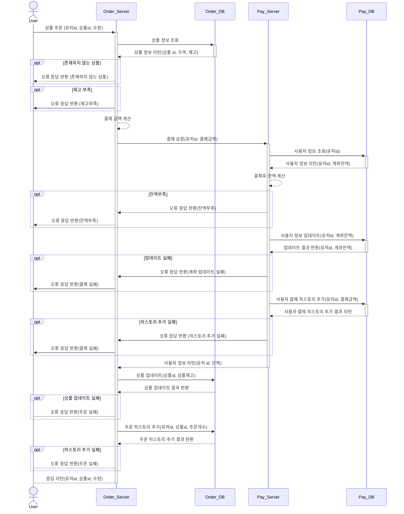

# hh-plus-3-commerce

e-커머스 상품 주문 서비스

## 기능 목록

- [ ] 잔액 조회 API
- [ ] 잔액 충전 API
    - [ ] 잔액 충전 내역 저장
    - [ ] 유저 ID, 충전 금액 입력 -> ID, 충전 후 금액 리턴
- [ ] 상품 조회 API
    - [ ] 상품 ID로 조회 -> ID, 이름, 가격, 잔여수량 리턴
- [ ] 상품 주문 API
    - [ ] 상품 주문 내역 저장
    - [ ] 유저 ID로 조회 -> ID, 상품 ID, 주문 수량 리턴
- [ ] 결제
    - [ ] 결제 내역 조회
    - [ ] 유저 ID, 결제금액 입력 -> 유저 ID, 잔액 리턴
- [ ] 인기 판매 상품 조회 API
    - [ ] 판매량 순으로 상품 조회

고도화

- [ ] 다중 인스턴스 지원 (동시성 고려)
- [ ] 멀티쓰레드 지원 (동시성 고려)
- [ ] 재고관리 (문제가 없도록?)
- [ ] 단위 테스트 작성

## 마일스톤

4주차 (10/13 ~ 10/18) - 4.5MD <기본 기능 구현>

- 잔액 조회 기능 구현 및 테스트코드 작성: 0.5MD
    - 잔액 조회 기능
    - 테스트 코드 (유닛테스트)
- 잔액 충전 기능 구현 및 테스트코드 작성: 0.5MD
    - 잔액 충전 기능
    - 잔액 충전 내역 저장
    - 테스트 코드 (유닛테스트)
- 상품 조회 기능 구현 및 테스트코드 작성: 0.5MD
    - 상품 조회 기능
    - 테스트코드 (유닛테스트)
- 상품 주문 기능 구현 및 테스트코드 작성: 1MD
    - 상품 주문 기능
    - 주문 내역 저장
    - 테스트코드 (유닛테스트)
- 결제 주문 기능 구현 및 텥스트코드 작성: 1MD
    - 결제 기능
    - 결제 내역 저장
    - 테스트코드 (유닛테스트)
- 인기 상품 조회 API 구현 및 테스트코드 작성: 1MD
    - 인기 상품 조회 기능
    - 테스트코드 (유닛테스트)

5주차 (10/20~ 10/26) - 4MD <고도화>

- 동시성 고려, 보완: 2MD
    - 다중 인스턴스 지원
    - 멀티쓰레드 지원
- 리팩토링: 1MD
    - 코드 리팩토링
    - 이벤트 기반으로 변경 가능성 고려?
    - 비동기로 처리 가능성 고려?
- 통합테스트 작성: 1MD

## 상품 주문 API 시퀀스 다이어그램

