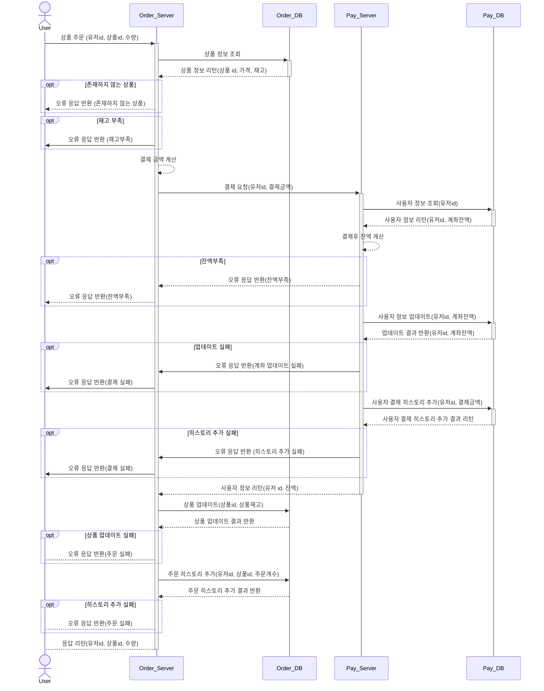

# hh-plus-3-commerce

e-커머스 상품 주문 서비스

## 상품 주문 API 시퀀스 다이어그램

```mermaid
sequenceDiagram
    actor User
    participant Order_Server
    participant Order_DB
    participant Pay_Server
    participant Pay_DB
    User->>+Order_Server: 상품 주문 (유저id, 상품id, 수량)
    Order_Server->>+Order_DB: 상품 정보 조회
    Order_DB-->>-Order_Server: 상품 정보 리턴(상품 id, 가격, 재고)
    opt 존재하지 않는 상품
    Order_Server-->>User: 오류 응답 반환 (존재하지 않는 상품)
    end
    opt 재고 부족
    Order_Server->>User: 오류 응답 반환 (재고부족)
    end
    Order_Server-->> Order_Server: 결제 금액 계산
    Order_Server->>+Pay_Server: 결제 요청(유저id, 결제금액)
    Pay_Server->>+Pay_DB: 사용자 정보 조회(유저id)
    Pay_DB-->>-Pay_Server: 사용자 정보 리턴(유저id, 계좌잔액)
    Pay_Server-->>Pay_Server: 결제후 잔액 계산
    opt 잔액부족
    Pay_Server-->>Order_Server: 오류 응답 반환(잔액부족)
    Order_Server-->>User: 오류 응답 반환(잔액부족)
    end
    Pay_Server->>+Pay_DB: 사용자 정보 업데이트(유저id, 계좌잔액)
    Pay_DB-->>-Pay_Server: 업데이트 결과 반환(유저id, 계좌잔액)
    opt  업데이트 실패
    Pay_Server->>Order_Server: 오류 응답 반환(계좌 업데이트 실패)
    Order_Server->>User: 오류 응답 반환(결제 실패)
    end
    Pay_Server->>+Pay_DB: 사용자 결제 히스토리 추가(유저id, 결제금액)
    Pay_DB-->>-Pay_Server: 사용자 결제 히스토리 추가 결과 리턴
    opt 히스토리 추가 실패
    Pay_Server->>Order_Server: 오류 응답 반환 (히스토리 추가 실패)
    Order_Server->>User: 오류 응답 반환(결제 실패)
    end
    Pay_Server-->>-Order_Server: 사용자 정보 리턴(유저 id, 잔액)
    Order_Server->>Order_DB: 상품 업데이트(상품id, 상품재고)
    Order_DB-->>Order_Server: 상품 업데이트 결과 반환
    opt 상품 업데이트 실패
    Order_Server-->User: 오류 응답 반환(주문 실패)
    end
    Order_Server->>Order_DB: 주문 히스토리 추가(유저id, 상품id, 주문개수)
    Order_DB-->>Order_Server: 주문 히스토리 추가 결과 반환
    opt 히스토리 추가 실패
    Order_Server-->User: 오류 응답 반환(주문 실패)
    end
    Order_Server-->-User: 응답 리턴(유저id, 상품id, 수량)
```