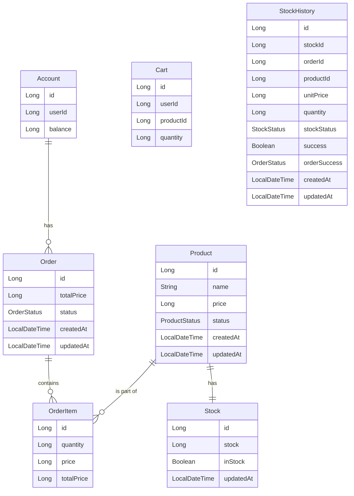

## ERD 

업데이트 내역:

- 2024.10.23: 최초 작성 (0.0.1)

설명:

- Account - 사용자 계좌 정보를 관리하는 엔티티. 유저와의 연관관계는 빠른 개발을 위해 생략
- Cart - 장바구니 정보를 관리하는 엔티티. 카트는 임시로 저장하는 용도이기 때문에 데이터 정합성보다 빠른 개발을 중시하여 연관관계를 맺지 않음.
- Order - 주문 정보를 관리하는 엔티티. Account와 연관.
- OrderItem - 주문 항목 정보를 관리하는 엔티티. 주문 시 개별 상품에 대한 정보를 저장. Order, Product와 연관.
- Product - 상품 정보를 관리하는 엔티티.
- Stock - 상품 재고 정보를 관리하는 엔티티. Product와 연관.
- StockHistory - 재고 변경 이력을 기록하는 엔티티. 재고 추가/감소 이력을 저장하며, 실패나 롤백된 작업도 기록. 연관관계를 맺지 않음.

